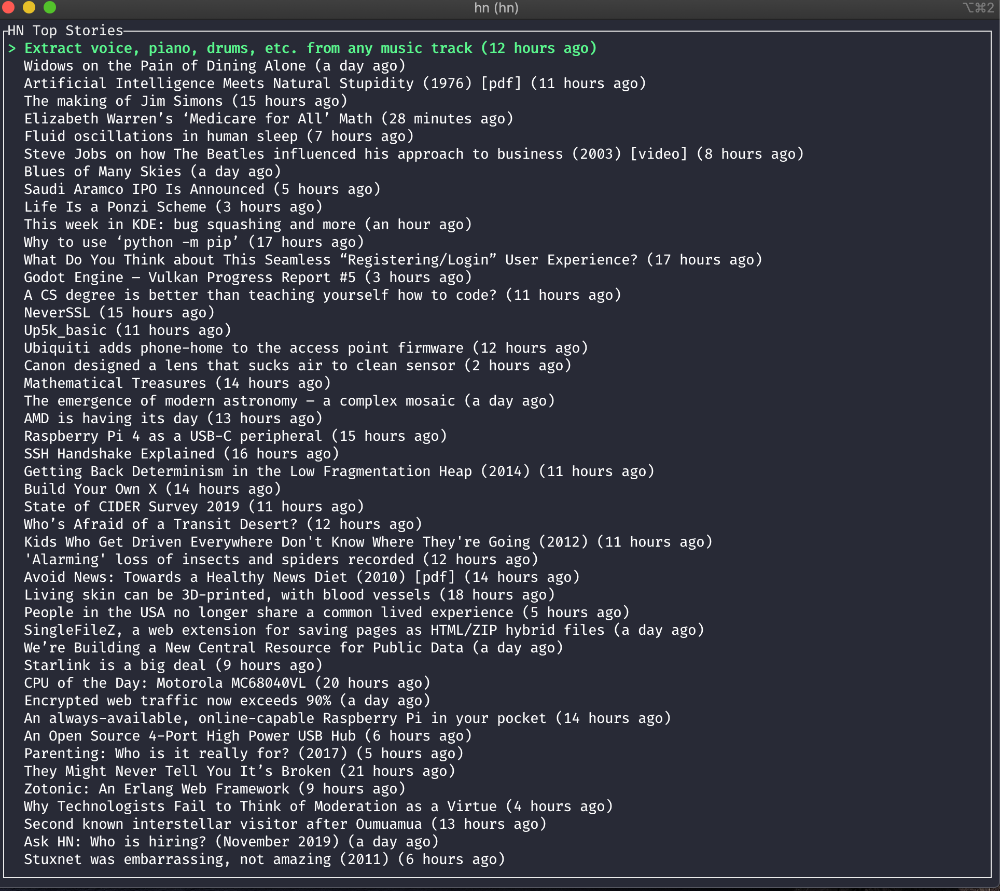

# HN
> Yet another HackerNews CLI written in Rust.

  

## Key Bindings

|Key|Description|
|---|---|
|k|Cursor up|
|j|Cursor down|
|CTRL+u|Scroll window upwards|
|CTRL+d|Scroll window downwards|
|g|Jump to top|
|G|Jump to bottom|
|Enter|Open default browser|
|CTRL+r|Reload articles|
|CTRL+c|Quit|

